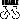
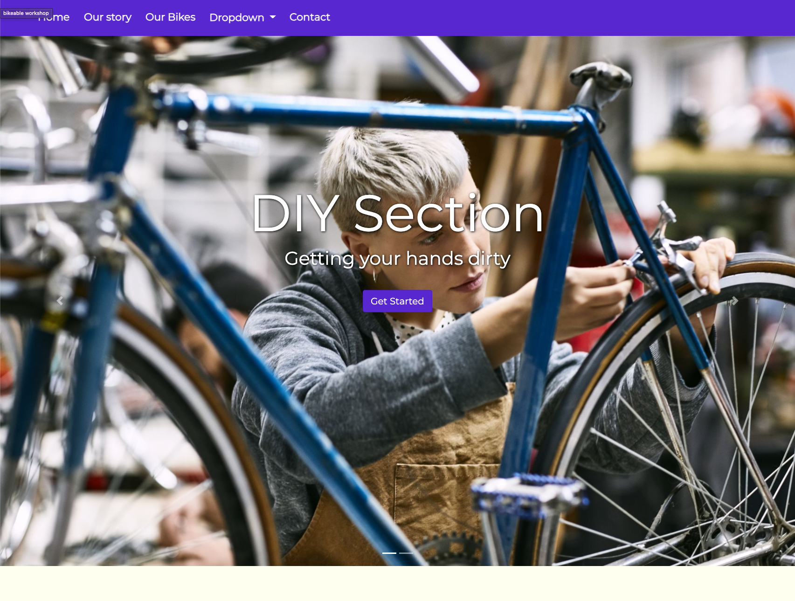
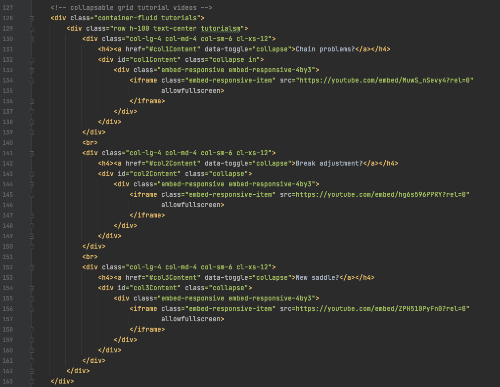
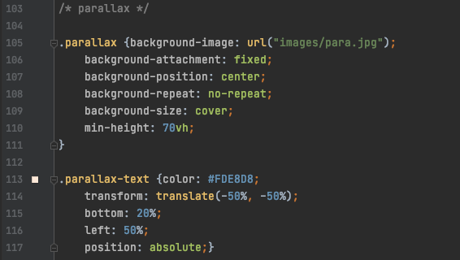
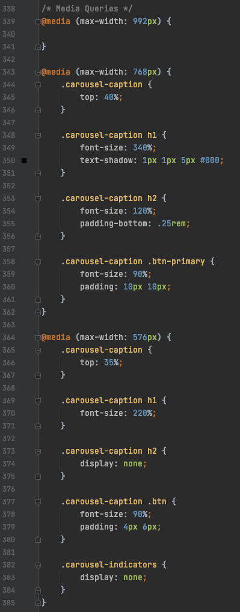

# Bikeable 

***

This is a simple multi-page website for a fictional chain retail store that aims at bringing the joy of riding a bike to everyone.

## Team
***

_Bikeable_ has been created by five dedicated people, namely, **Alexandra**, **Sanne**, **Amina**, **Younes** and **Julio**. They had their first introduction in working as a team together to make this company website. 
The website of _Bikeable_ has been divided so then each member would make one or two pages.

### Goal
***

The goal of this project was to create a fictional company and its associated website. As a team, they have chosen to invent a bicycle company that aims to give a perfect bike to their bike aficionado, *or not*, clients. 
The bicycle company is located in Belgium, Flanders.

### Creating process and deployment
***

This project is the result of a 3-day team effort in their first coding experience with a full scale website in the making. After deciding the fictional company, it was time to think about the company's corporate identity and how it would be displayed on the internet. Appropriate color schemes were implemented in the layout mock-up in alignment with with the general idea of the company’s web pages. 
This repository is the final result of this group project.

Check out our [website](https://juliocesarteixeira.github.io/Bikeable_repo/).

#### Technologies used 
* **HTML5**
* **CSS3**
* **Bootstrap 4 & 5**
* **Font Awesome**

1. Carousel image slider 

   
* Carousel code Snippet
   
  
2. Collapsable menu 
   
   
3. Parallax image
   

4. Media Query responsive design
   

